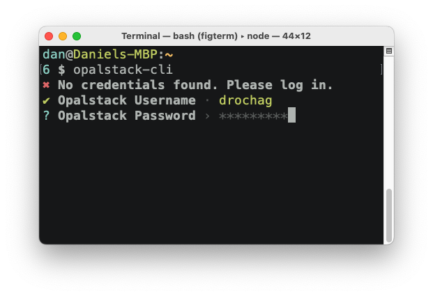
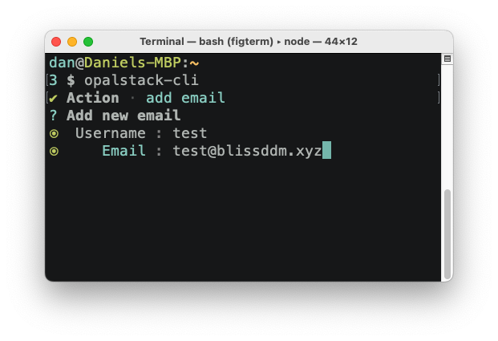
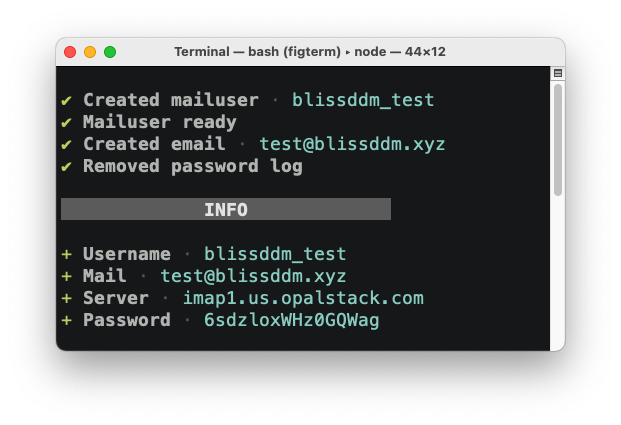

# Opalstack CLI [![Opalstack CLI][npm-img]][npm-link]

Opalstack CLI is a simple CLI to do some Opalstack actions without the need of a browser using their [API](https://docs.opalstack.com/user-guide/api/)

Login through CLI

<p align="center">
  
</p>

Add an email

<p align="center">
  
</p>

Receive information about your operation

<p align="center">
  
</p>

[npm-img]: https://img.shields.io/npm/v/opalstack-cli?style=flat-square
[npm-link]: https://www.npmjs.com/package/opalstack-cli

## Usage

<p align="center">
  <video src="./img/Opalrecording.mp4" alt="Opalstack CLI demo" width="629">
</p>

Install

```bash
$ npm install opalstack-cli
```

you will be asked to log in if you haven't already done it, otherwise it'll take credentials from your credentials file locally

### Call commands directly

```bash
$ opalstack-cli --help
Opalstack CLI
add:
         opalstack-cli add email <username> <email>

$ opalstack-cli add email test_username test@email.com
```

### Current operations

- Add an email
- More to come ...
